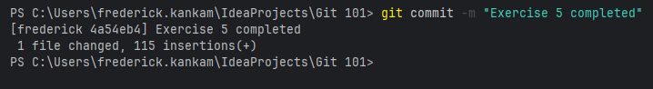
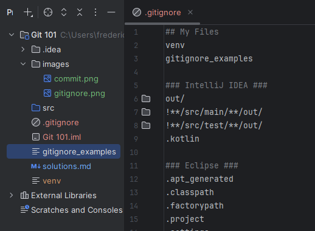
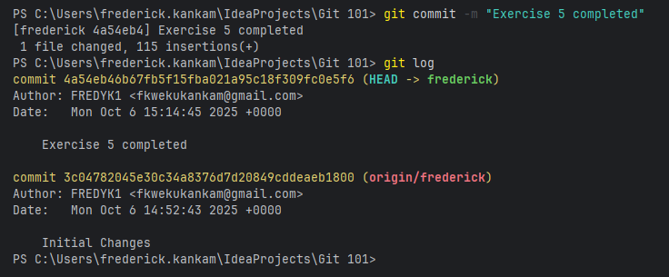
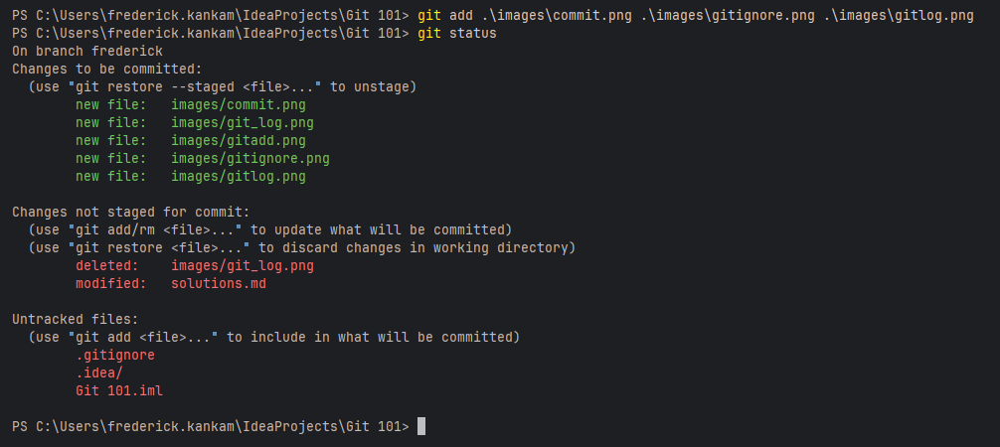
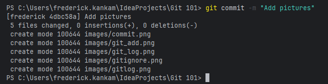
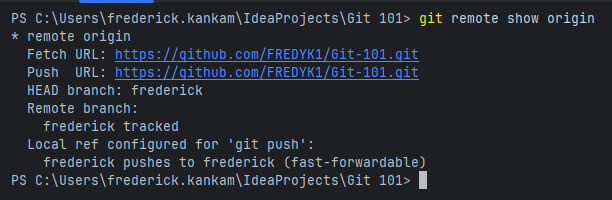
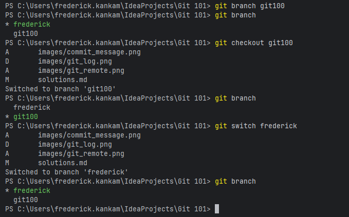
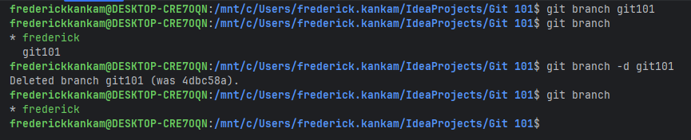
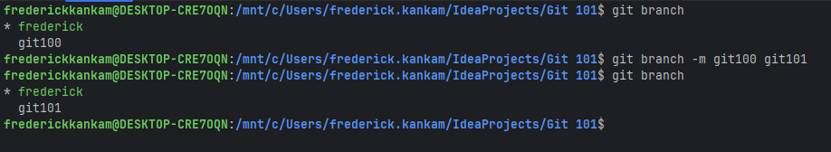

# Git 101🧑🏻‍🚀

## Exercise 1
### Who created git? and what is the essence of git.
Linus Torvalds created git in 2005 to help manage the development of the Linux kernel. 
The essence of git is to provide a distributed version control system that allows multiple developers to collaborate on code ,
track changes, and maintain a history of modifications efficiently.

## Exercise 2
### What is the difference between git, gitlab and github?
Git is a distributed version control system which is a command-line tool that can be used locally on a developer's machine.
GitHub and GitLab are web-based platforms that provide hosting for Git repositories, along with additional features for collaboration, project management, and continuous integration/continuous deployment (CI/CD).
GitHub is widely used for open-source projects and has a large community, while GitLab offers more built-in CI/CD features and can be self-hosted for private repositories.

## Exercise 3
### Apart from git, is there any other version control system? If there is, kindly list them.
Yes, there are several other version control systems apart from Git. Some of the notable ones include:
1. Subversion (SVN)
2. Mercurial
3. Perforce
4. CVS (Concurrent Versions System)
5. TFS (Team Foundation Server)
6. Bazaar
7. BitKeeper
8. Fossil
9. Plastic SCM
10. Darcs
11. Monotone
12. Vesta
13. RCS (Revision Control System)
14. ClearCase
15. Helix Core (formerly Perforce Helix)

## Exercise 4
What does `git init` and `git status` do?
- `git init`: This command initializes a new Git repository in the current directory. 
It creates a hidden `.git` directory that contains all the necessary files and structures for version control.
- `git status`: This command displays the current state of the working directory and the staging area.
It shows which files are untracked, modified, staged for commit, or have conflicts.

## Exercise 5
### What is a `commit` in git. Explain and show examples of a commit in the terminal.
A commit in Git is a snapshot of the changes made to the files in a repository at a specific point in time.

## Exercise 6
### In git, there is a way to ignore file, how is this done.
This is done using a `.gitignore` file. List the files you want to ignore in this file.

### Create some files and intentionally ignore them.

## Exercise 7
### What does `git log` do? Show examples of `git log` in the terminal.
Git log shows the commit history for the repository. It displays a list of commits along with their unique identifiers (hashes), author information, dates, and commit messages.

## Exercise 8
### What does it mean to do `git add`.
To do git add means to add changes in the working directory to the staging area.

## Exercise 9
### What is a staging area in git and how do you get items into the staging area.
The staging area in git is a place where you can group changes that you want to include in your next commit.
You can get items into the staging area by using the git add command.

### Illustrate this in the terminal by moving an untracked file to the tracked state and then staging area.

## Exercise 10
### How do you commit in git with the message on the same line?

## Exercise 11
### What is the difference between the `pull`,`push` and `fetch` command in git.
- `git pull`: This command is used to fetch and integrate changes from a remote repository into the current branch of your local repository. It combines the actions of `git fetch` and `git merge`.
- `git push`: This command is used to upload local repository content to a remote repository. It transfers commits from your local branch to a branch in the remote repository.
- `git fetch`: This command is used to download commits, files, and references from a remote repository into your local repository

## Exercise 12
### What command do you run in git, if you want to see more information about a remote in git. Illustrate this in the terminal and try and understand the output. Please contact Caleb, if you do not.

## Exercise 13
### What is the difference between rebase and merge in git. Illustrate with examples.
- `git merge`: This command is used to combine the changes from one branch into another branch. It creates a new commit that includes the changes from both branches, preserving the history of both branches.
- `git rebase`: This command is used to move or combine a sequence of commits to a new base commit. It rewrites the commit history by applying the changes from one branch onto another branch, resulting in a linear history without merge commits.

## Exercise 14
### What is `git checkout`?
git checkout is a git command used to switch amongst branches 

### `git checkout` has another alias. What is it?
git checkout alias is `git switch`
 
### Show that both checkout and its alias are doing the same thing in the terminal.

## Exercise 15
### What are tags in git, and what types of tags are there?
git tags are references that point to specific points in Git history. They are often used to mark release points (e.g., v1.0, v2.0) or important milestones in a project's development.
There are two main types of tags in Git:
1. Lightweight Tags: These are simple references to a specific commit. They do not contain any additional metadata, such as the tagger's name, date, or message. Lightweight tags are essentially just pointers to a commit.
2. Annotated Tags: These are full objects in the Git database. Annotated tags contain additional metadata, including the tagger's name, email, date, and a message.

## Exercise 16
### Do you know that, you can delete a branch in git?
Yes

### Create a branch and delete it.

### Wait....what is the difference between deleteing with `-d` and `-D` arguments in git?
The difference between `-d` and `-D` when deleting a branch in Git is as follows:
- `-d` (lowercase d): This option is used to delete a branch only if it has already been fully merged into its upstream branch or the current branch. If the branch has unmerged changes, Git will prevent the deletion and display an error message.
- `-D` (uppercase D): This option is a force delete. It deletes the branch regardless of its merge status. This means that even if the branch has unmerged changes, it will be deleted without any warnings.

## Exercise 17
### Can you change a branch name? If yes what is the command? Illustrate this in the terminal.

## Exercise 18
### What does it mean to revert a commit to a previous commit?
Reverting a commit means to create a new commit that undoes the changes made in a previous commit, effectively reversing its effects without altering the commit history.

### What does it to reset to a previous commit?
Resetting to a previous commit means to move the current branch pointer back to a specific commit, effectively discarding any commits made after that point.

### What is the difference between the reset and revert?
Reset changes the commit history by moving the branch pointer, while revert creates a new commit that undoes changes without altering the history.

## Exercise 19
### Resolving Conflicts
  Scenario:
    * In the main-branch, create a file and name it calculator.py
    * Add 4 functions into this file, the functions are: add,subtract,multiply and divide.
    * Implement these functions and test them to see if it works.
    * Create two branches from main: feature-a and feature-b
    * In feature-a, modify the same line in your calculator.py file
    * Commit the change
    * Switch to feature-b and modify the SAME line differently
    * Commit this change too
    * Try to merge both branches into main (one will conflict)
    * Resolve the conflict manually by accepting both changes
    * Complete the merge.
